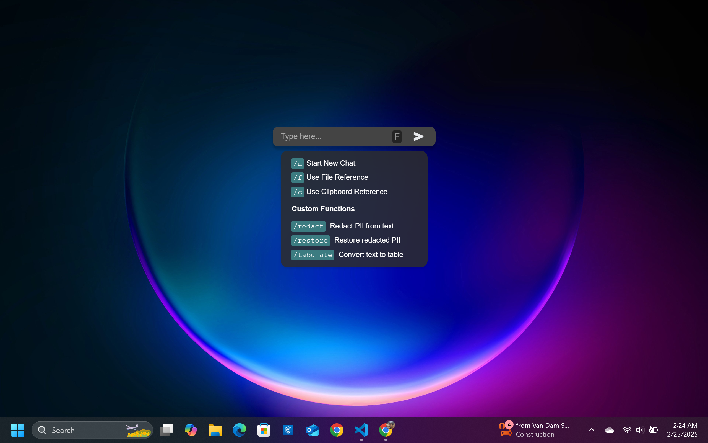

# Outrface

A tool that enables users to take advantage of the capabilities of local AI seamlessly without friction caused by multiple interfaces.

### Features

- **Ctrl + Space to Launch**: Quickly launch the app using the Ctrl + Space shortcut.
- **Slash Commands**: Use slash commands to add files and clipboard content as reference.
- **Custom Functions**: Utilize custom functions to make prompting easier.
- **Seamless Integration**: Eliminate the need to surf through multiple AI interfaces with a single, seamless app.

### Preview


### Installation

1. **Clone the repository**:  
   ```sh
   git clone https://github.com/abhishekk962/outrface.git
   cd outrface
   ```

2. **Install dependencies**:
   ```sh
   npm install
   ```

3. **Install LM Studio v0.3.5**:  
   [Download here](https://releases.lmstudio.ai/linux/x86/0.3.5/beta/9h/LM_Studio-0.3.5.AppImage).  
   *(Use v0.3.5 for QNN model compatibility. Future versions may not support it.)*

4. **Download Llama 3.2 3B Model**:
   - **Beta access**: Download Llama 3.2 3B QNN to the model directory.  
   - **No beta access**: Download Llama 3.2 3B Instruct from the LM Studio interface.

5. **Update the configuration**:  
    In LM Studio, locate the `indexedModelIdentifier` in the model details. Copy it and update the `modelPath` in [config.json](src/config.json).

6. **Start the application**:  
   *(Ensure LM Studio is running. For headless mode, enable Local LLM Service in LM Studio settings.)*  
   ```sh
   npm start
   ```

## License
[MIT License](LICENSE)

